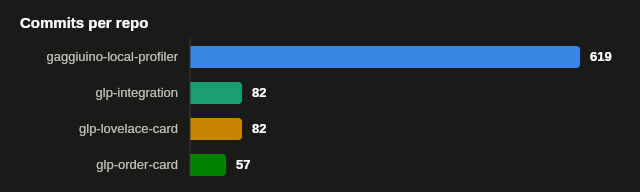
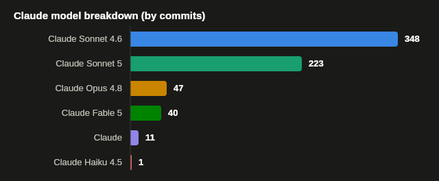

# Development Stats

Generated 2026-08-03 by `scripts/dev-stats.mjs`. Re-run it any time to refresh these numbers — they are computed live from git history, not hand-maintained.

## Timeline

The GLP ecosystem (this app + 3 companion repos) has been in development since **2026-05-20** — **76 days** as of the last commit (2026-08-03).

| Repo | First commit | Last commit | Commits | Claude co-authored |
|---|---|---|---|---|
| gaggiuino-local-profiler | 2026-05-20 | 2026-08-03 | 743 | 552 (74%) |
| glp-integration | 2026-05-22 | 2026-08-03 | 145 | 97 (67%) |
| glp-lovelace-card | 2026-05-24 | 2026-08-03 | 118 | 91 (77%) |
| glp-order-card | 2026-05-25 | 2026-08-03 | 95 | 70 (74%) |
| **Combined** | **2026-05-20** | **2026-08-03** | **1101** | **810 (74%)** |

Combined line changes (insertions + deletions across all commits): **310.779**, of which **232.427** landed in Claude-co-authored commits.

Commits without a Claude co-author line are presumed human-only (manual fixes, merges, config tweaks) — not independently verified.

## Claude model breakdown (by commit co-author line)

| Model | Commits |
|---|---|
| Claude Sonnet 5 | 357 |
| Claude Sonnet 4.6 | 348 |
| Claude Opus 4.8 | 47 |
| Claude Fable 5 | 40 |
| Claude | 11 |
| Claude Opus 5 | 4 |
| Claude Haiku 4.5 | 3 |

The exact co-author string varies by era as model names changed over the project's lifetime — this table groups by the literal string used in each commit, so the same underlying model released under a new name shows up as a separate row.

## Rough cost estimate (illustrative only — not real billing data)

This is **not** measured token usage or an actual invoice. It multiplies changed lines (insertions + deletions) in Claude-co-authored commits by an assumed 25 tokens/line (covers the conversation and planning overhead around a diff, not just the diff bytes), then applies the price table in `scripts/dev-stats.pricing.json` — which ships with every price set to `null` until you fill in your own plan/API rates.

**Estimated cost: ~$33.81** across 227.138 priced lines (+ 5.286 lines from unpriced models, excluded from this total).

---
*This file is generated. Do not hand-edit — re-run `node scripts/dev-stats.mjs` instead.*
