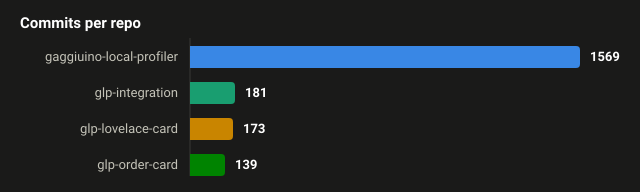
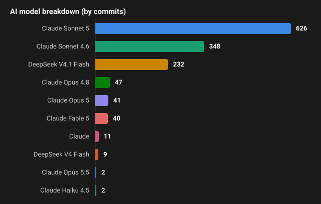

# Development Stats

Generated 2026-09-10 by `scripts/dev-stats.mjs`. Re-run it any time to refresh these numbers — they are computed live from git history, not hand-maintained.

## Timeline

The GLP ecosystem (this app + 3 companion repos) has been in development since **2026-05-20** — **114 days** as of the last commit (2026-09-10).

| Repo | First commit | Last commit | Commits | Claude co-authored |
|---|---|---|---|---|
| gaggiuino-local-profiler | 2026-05-20 | 2026-09-10 | 1191 | 822 (69%) |
| glp-integration | 2026-05-22 | 2026-09-07 | 175 | 79 (45%) |
| glp-lovelace-card | 2026-05-24 | 2026-09-07 | 161 | 89 (55%) |
| glp-order-card | 2026-05-25 | 2026-09-07 | 127 | 61 (48%) |
| **Combined** | **2026-05-20** | **2026-09-10** | **1654** | **1051 (64%)** |

Combined line changes (insertions + deletions across all commits): **480.358**, of which **381.118** landed in Claude-co-authored commits.

Commits without a Claude co-author line are presumed human-only (manual fixes, merges, config tweaks) — not independently verified.

## Hours of development (lower-bound estimate)

Clustering each repo's commit timestamps into working sessions — commits within 2h of each other join the same session, and each session gets a 30-minute lead-in credited ahead of its first commit — gives a combined **505.3 hours** across all four repos.

| Repo | Hours (session-clustered) |
|---|---|
| gaggiuino-local-profiler | 320.2 |
| glp-integration | 68.5 |
| glp-lovelace-card | 62.3 |
| glp-order-card | 54.3 |
| **Combined** | **505.3** |

This is a **lower-bound estimate derived from git commit timestamps only**, not measured time — it undercounts real work because a long AI-agentic session (orchestration, agent dispatch, review between infrequent commits) can run for hours between commits.

## Claude model breakdown (by commit co-author line)

| Model | Commits |
|---|---|
| Claude Sonnet 5 | 560 |
| Claude Sonnet 4.6 | 348 |
| Claude Opus 4.8 | 47 |
| Claude Opus 5 | 43 |
| Claude Fable 5 | 40 |
| Claude | 11 |
| Claude Haiku 4.5 | 2 |

The exact co-author string varies by era as model names changed over the project's lifetime — this table groups by the literal string used in each commit, so the same underlying model released under a new name shows up as a separate row.

## Claude Pro subscription cost

Max pays a flat **$20/month** for Claude Pro, regardless of usage volume — this is the actual subscription cost, not a token-usage estimate. 5 months since the first commit (2026-05-20) works out to **$100.00**.

This assumes a continuous subscription for the whole span — it does not account for any gaps where the subscription might have lapsed.

---
*This file is generated. Do not hand-edit — re-run `node scripts/dev-stats.mjs` instead.*
