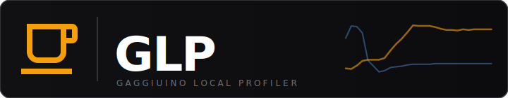
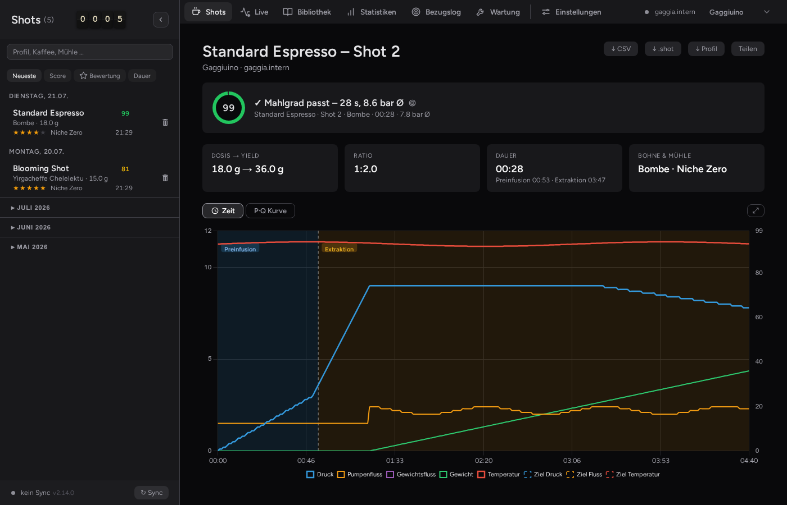
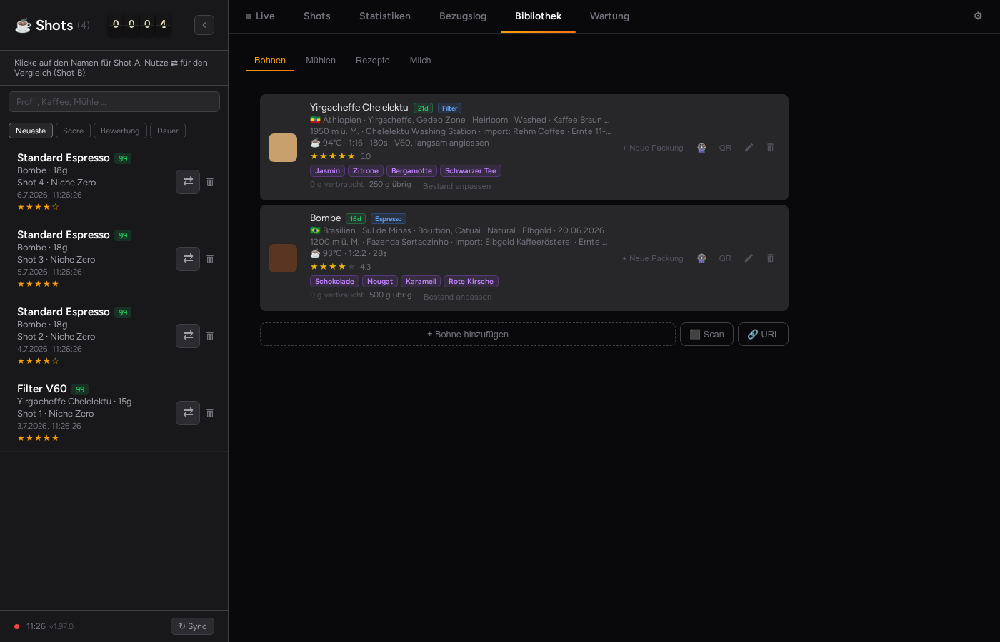
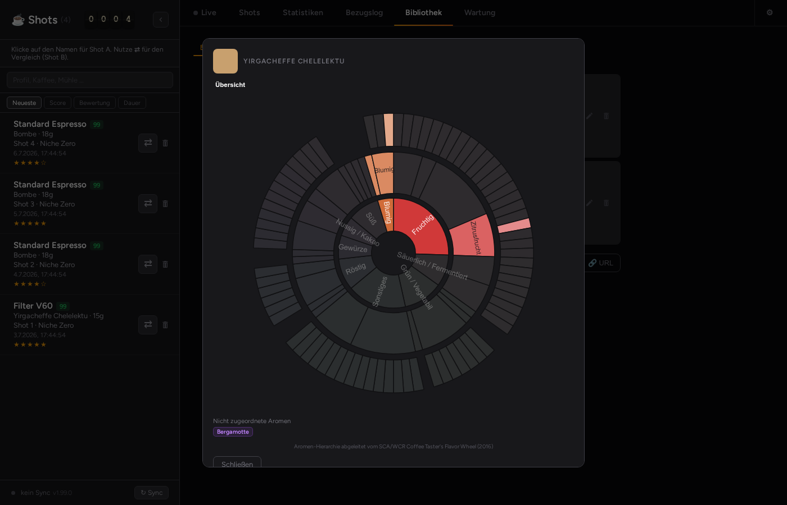
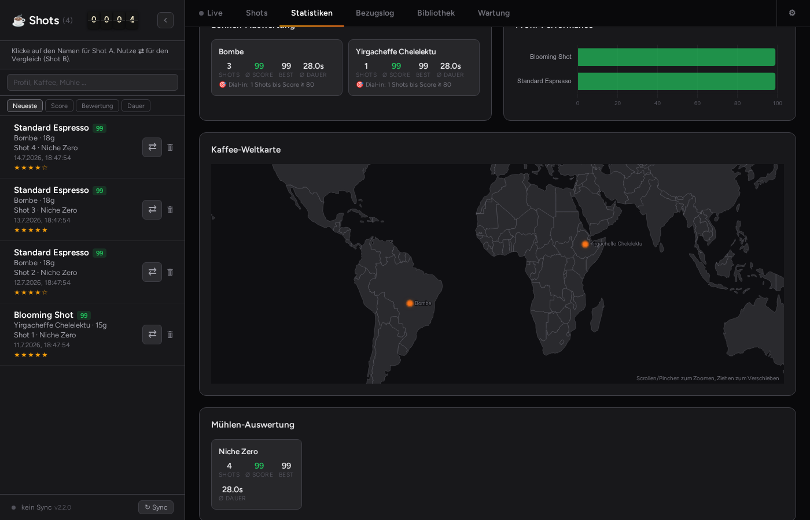

<p align="center">
  
</p>

<p align="center">
  <a href="https://github.com/mxkissnr/gaggiuino-local-profiler/releases/latest">
    
  </a>
  
  
  
  
  
  
</p>

<p align="center">
  Local shot-profiling dashboard for <a href="https://gaggiuino.github.io/">Gaggiuino</a>-based espresso machines.<br/>
  Syncs shots automatically, visualizes extraction profiles and provides a real-time live view — all from Home Assistant.
</p>

---

> **Heads-up — this requires a Gaggiuino-modified machine.** GLP does not work with stock espresso machines. [Gaggiuino](https://gaggiuino.github.io/) is a hardware mod (custom controller, pressure/temperature sensors) for Gaggia Classic and similar machines. If your machine doesn't run Gaggiuino firmware yet, start there first.

## Why GLP?

You love your Gaggiuino machine, but your shot data disappears into the void? GLP brings live extraction charts, a searchable coffee library and full analytics straight into Home Assistant — completely local, no cloud, no account. From *"what was that bean from last week again?"* to a real shot archive with automatic scoring, compare view and flavor wheel: everything runs on your HA server, and your data stays yours.

## 🔗 The GLP Ecosystem

| Component | Version | Requires |
|---|---|---|
| **GLP App** (this repo) |  | Gaggiuino machine + HA OS/Supervised |
| [**GLP Integration**](https://github.com/mxkissnr/glp-integration) |  | App v1.82.7+ · [HACS](https://hacs.xyz) |
| [**GLP Shot Card**](https://github.com/mxkissnr/glp-lovelace-card) |  | Integration v1.9.0+ |
| [**GLP Order Card**](https://github.com/mxkissnr/glp-order-card) |  | Integration v1.7.0+ |

All four components are optional and independently installable — only install what you need.

> **No longer requires ALERTua/hass-gaggiuino** — as of GLP Integration v1.9.0 all machine sensors (temperature, pressure, water level, weight, profiles, switch states) are provided natively.

---

## ⚡ Quick Install

<p>
  <a href="https://my.home-assistant.io/redirect/supervisor_add_addon_repository/?repository_url=https%3A%2F%2Fgithub.com%2Fmxkissnr%2Fgaggiuino-local-profiler">
    
  </a>
</p>

Click the button above to add this repository directly to your Home Assistant — no copy-pasting needed.

---

## 📸 Screenshots

<p align="center">
  
  
</p>
<p align="center">
  
  
</p>

More in [`docs/screenshots/`](gaggiuino-local-profiler/docs/screenshots/) (Maintenance, Dial-in). Regenerated on demand via `node scripts/screenshots.mjs`.

---

## ✨ Features

| | Feature | Description |
|---|---|---|
| 📈 | **Shot Archive** | All shots with pressure, flow, weight and temperature curves |
| 🔴 | **Live Mode** | Real-time display directly from the controller (`/api/system/status`) |
| 🔄 | **Auto-Sync** | New shots load automatically when `gaggiuino_latest_shot_id` rises |
| ⇄ | **Compare Mode** | Overlay two shots side by side |
| 🏆 | **Shot Score** | Automatic 0–100 score (pressure, stability, duration, ratio, channeling) |
| 📊 | **Analytics** | Score trend, shot calendar heatmap, bean stats, profile performance, interactive coffee world map (zoom/pan, per-bean origin points) |
| 📊 | **P·Q Diagram** | Pressure vs. flow chart — reveals extraction signature |
| ⚗️ | **EY Calculation** | Extraction Yield % when TDS and dose are entered |
| ☕ | **Grind Recommendation** | Automatic advice based on shot duration and channeling |
| 📅 | **Roast Date & Freshness** | Days since roast as colored badge (green: 7–21 days optimal) |
| ☕ | **Coffee Library** | Persistent bean and grinder database with autocomplete; roast date auto-fills; variety, processing, roast type, growing region, altitude, importer, harvest, price, producer, certification and a manual brew recommendation (temperature/ratio/time) — all shown only when set |
| 🎛 | **Machine Profile Editor** | Visual editor for Gaggiuino machine profiles in a new "Profiles" tab — name, recipe, and a full phase editor (type, target curve, restriction, stop conditions) with a live preview chart; "Create profile" on a bean card pre-fills a profile suggestion derived from that bean's decaf/process/roast attributes; sends directly to the machine over its WebSocket API |
| 🎡 | **Flavor Wheel** | Interactive aroma sunburst per bean, built from structured tasting-note tags — see [Acknowledgements](#acknowledgements) for the SCA/WCR data credit |
| ⭐ | **Bean Rating** | Star rating per bean, computed automatically as the average of that bean's shot ratings — no manual field |
| 🖼️ | **Bean, Grinder & Shot Photos** | Bean photo imported once from the shop on URL import; grinder photo uploaded directly from your device — plus grinder burr type and purchase date; each shot can also have its own photo (e.g. the cup/crema), shown as a small round thumbnail in the sidebar |
| 📝 | **Annotations & Rating** | Coffee, grinder, grind setting, dose, roast date, TDS, notes, **drink type** (from menu); 1–5 stars; auto-saves 1 s after last keystroke |
| 🔍 | **Shot Search** | Filter sidebar by profile, coffee, grinder |
| ⛶ | **Fullscreen Chart** | Expand chart to fullscreen with auto landscape rotation on mobile |
| 💾 | **.shot Export** | Export in Decent Espresso format (Visualizer.coffee compatible) |
| 📤 | **CSV Export** | All shots with annotations as CSV |
| 🖼️ | **Share Card** | Export any shot as a 1080×1080 PNG card — score, pressure curve, metadata and GLP branding. Share button uses the native Web Share API on mobile or downloads the PNG on desktop. |
| 🔌 | **Smart Plug** | Optional: power machine on/off via HA switch entity |
| ☕ | **Preheat Timer** | Progress bar + countdown after machine switches on; configurable warmup time; smart reset (ignores brief off/on cycles while still warm) |
| 🌐 | **Multi-Language UI** | DE / EN / IT / FR / ES / NL — auto-detected from browser, persisted per session |
| 🎨 | **Accent Color Themes** | 5 color schemes: Amber (default), Ocean, Aurora, Ember, Forest — persisted in localStorage |
| 🔧 | **Grinder Maintenance** | Per-grinder cleaning schedule with configurable shot or day threshold; cards shown alongside machine maintenance tasks |
| 📷 | **Barcode / QR Scanner** | Scan coffee bag barcodes (EAN/UPC) via camera — name and roaster looked up on Open Food Facts; GLP QR schema for full bean import between installations; each bean card generates a shareable QR code |
| 🔗 | **Roaster URL Import** | Paste a product URL from kaffeebraun.com, hoppenworth-ploch.de or elbgold.com (each toggleable in settings) — name, roaster, photo, aromas, origin country, variety, roast type, processing, growing region, altitude/importer/harvest/price (where the shop provides them) and decaf flag are imported automatically; any other shop falls back to a generic Shopify / JSON-LD / webpage-metadata parser, and custom Shopify domains can be added; imported beans show source, import method and import date |
| 🌙 | **Light / Dark theme** | Built-in theme toggle (Settings); choice persisted in localStorage; matching `glp-ha-theme.yaml` for the full HA interface |
| 🎛️ | **Profile Selector** | Lovelace card shows a dropdown to switch the active brew profile via `select.gaggiuino_profiler_profile` (provided by GLP Integration v1.9.0+) |
| 📋 | **Order Management** | Barista backend tab to manage espresso orders — queue, accept with ETA, complete or decline with reason; configurable menu (emoji + drink name); bean and milk variants offered only while actually in stock (milk is deducted automatically on order completion) and while manually enabled — a bean can be temporarily excluded from ordering without deleting it or touching its stock, with customer-facing bean descriptions (taste notes, origin, processing); companion Lovelace card for customers (`glp-order-card`) |
| 🧭 | **First-Run Onboarding & Demo Mode** | Dismissible banner when the machine isn't reachable; first-run panel with setup steps plus a "Load demo data" button that seeds a sample dataset (shots, beans, a blend, a recipe) so the app can be evaluated before connecting hardware; "End demo" removes exactly the seeded rows |
| 📱 | **Installable App (PWA)** | Install GLP as a standalone app when accessed directly over HTTPS (own icon, no browser chrome, offline app shell); server-side gated so it's never offered inside the HA Companion App/Ingress panel, which keeps running as a normal embedded panel |

---

## 🚀 Installation

### Step 1 — Add this repository to Home Assistant

Either click the Quick Install button above, or manually:

1. Go to **Settings → Apps → App Store**
2. Click **⋮ → Repositories**
3. Add:
   ```
   https://github.com/mxkissnr/gaggiuino-local-profiler
   ```
4. Search for **Gaggiuino Local Profiler** and click **Install**

### Step 2 — Install the GLP Integration (recommended)

The [GLP HA Integration](https://github.com/mxkissnr/glp-integration) exposes all app data as native HA sensors — usable in automations, energy dashboards and Lovelace cards. Required for the GLP Shot Card and GLP Order Card.

**Install via HACS:** HACS is the community store for Home Assistant — one-time setup guide at [hacs.xyz](https://hacs.xyz) if you don't have it yet.

<a href="https://my.home-assistant.io/redirect/hacs_repository/?owner=mxkissnr&repository=glp-integration&category=integration">
  
</a>

After installing, go to **Settings → Devices & Services → Add Integration** and search for **Gaggiuino Local Profiler**.

### Step 3 — Configure the app

In the app options set your controller URL:

```yaml
machine_host: "192.168.1.42"           # IP or hostname of your Gaggiuino controller
sync_interval: 5
switch_entity: "switch.espresso_plug"  # optional
```

> **Verify connectivity** from the HA terminal:
> ```bash
> curl http://<gaggiuino-ip>/api/shots/latest
> ```

### Step 4 — Open the dashboard

Click **Open Web UI** in the app page — or open it directly from your HA sidebar under **GLP**.

---

## ⚙️ Configuration

| Option | Default | Description |
|---|---|---|
| `machine_host` | `gaggia.intern` | IP or hostname of the Gaggiuino controller |
| `sync_interval` | `5` | Auto-sync interval in minutes (1–60) |
| `switch_entity` | *(empty)* | HA switch entity to power the machine on/off |

---

## 🏠 Embed in HA Dashboard

Add the profiler as a card in any Lovelace dashboard:

**Webpage Card:**
1. Edit dashboard → **Add Card → Webpage**
2. URL: `/api/hassio_ingress/gaggiuino_local_profiler/`

**Or via YAML:**
```yaml
type: iframe
url: /api/hassio_ingress/gaggiuino_local_profiler/
aspect_ratio: "16:9"
```

---

## 🏗️ Architecture

```
Home Assistant Host
├── GLP App  (Node.js / Express, Port 8099)
│   ├── /data/glp.db              ← SQLite database (shots, annotations, library, …)
│   └── Supervisor API            ← HA switch control & sensor polling
│
└── Gaggiuino Controller
    ├── GET /api/shots             ← Shot list & profiles
    └── GET /api/system/status     ← Live data (1 s polling)
```

---

## Development at a glance

<p align="center">
  
  
</p>

Full numbers (timeline, per-model breakdown, cost estimate) generated live from git history: see [DEVELOPMENT.md](DEVELOPMENT.md).

---

<p align="center">
  <a href="https://github.com/mxkissnr/gaggiuino-local-profiler/wiki">📖 Documentation (EN)</a> ·
  <a href="https://github.com/mxkissnr/gaggiuino-local-profiler/wiki/Home-de">📖 Dokumentation (DE)</a> ·
  <a href="gaggiuino-local-profiler/CHANGELOG.md">📋 Changelog</a> ·
  <a href="https://github.com/mxkissnr/gaggiuino-local-profiler/issues">🐛 Issues</a> ·
  <a href="DEVELOPMENT.md">📊 Dev Stats</a>
</p>

---

## License

GPL-3.0 © 2024–2026 mxkissnr — free to use, fork and modify; any derivative work must remain open source under the same license. Commercial use is not permitted.

## Acknowledgements

Inspired by [BeanConqueror](https://github.com/graphefruit/beanconqueror) by graphefruit — a fantastic open-source coffee tracking app that pioneered many of the ideas around shot logging and coffee library management that influenced this project.

Built on top of the [Gaggiuino](https://gaggiuino.github.io/) project. The machine sensor integration in glp-integration was inspired by [ALERTua/hass-gaggiuino](https://github.com/ALERTua/hass-gaggiuino) — the original Home Assistant integration for Gaggiuino. Thank you to [@ALERTua](https://github.com/ALERTua) for pioneering the HA connectivity concepts that made this possible.

The in-app flavor wheel's category structure follows the SCA (Specialty Coffee Association) / WCR (World Coffee Research) *Coffee Taster's Flavor Wheel* (2016). `public-src/flavor-data.js` is our own derived dataset (labels in all 6 UI languages — DE, EN, IT, FR, ES, NL — and a German alias table) — no artwork from the original wheel is used or reproduced.

## Disclaimer

GLP is an independent, community-built companion project. It is not officially affiliated with, endorsed by, or supported by the [Gaggiuino](https://gaggiuino.github.io/) firmware project or its maintainers.

---

<p align="center">
  <sub>Built with AI assistance — designed and developed together with <a href="https://claude.ai">Claude</a> by Anthropic</sub>
</p>
