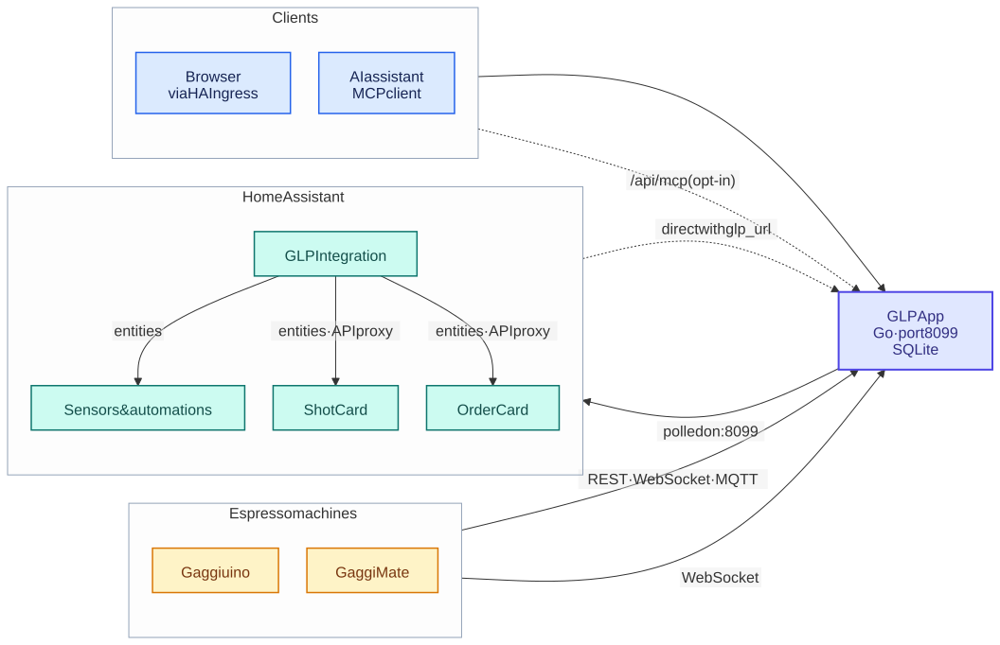
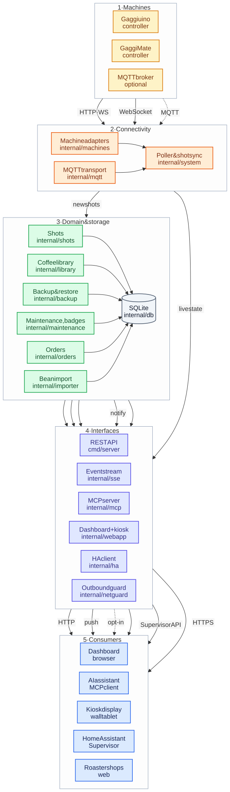

<p align="center">
  
</p>

<p align="center">
  <a href="https://github.com/mxkissnr/gaggiuino-local-profiler/releases/latest">
    
  </a>
  
  
  
  
  
</p>

<p align="center">
  Local shot-profiling dashboard for <a href="https://gaggiuino.github.io/">Gaggiuino</a>- and <a href="https://github.com/jniebuhr/gaggimate">GaggiMate</a>-based espresso machines.<br/>
  Syncs shots automatically, visualizes extraction profiles and provides a real-time live view — all from Home Assistant.
</p>

---

> **AI-built project.** Almost all code, tests and documentation are written by AI models — mainly Claude (Anthropic), with DeepSeek in the automated agent pipeline — plus community contributions. A human maintainer sets the scope, reviews every change, tests on real hardware (Gaggia Classic + Gaggiuino) and makes all release decisions. Keep that in mind before installing this on your machine.

> **armv7 (32-bit ARM) is supported** alongside amd64 and aarch64. The armv7 image is not regularly tested on real hardware.

> **Heads-up — this requires a machine running [Gaggiuino](https://gaggiuino.github.io/) or [GaggiMate](https://github.com/jniebuhr/gaggimate) firmware.** GLP does not work with stock espresso machines. Both are hardware mods (custom controller, pressure/temperature sensors) — Gaggiuino and GaggiMate are both fully supported (see the [wiki: Features](https://github.com/mxkissnr/gaggiuino-local-profiler/wiki/Features) page). These mods aren't limited to one machine brand: **the "type" GLP asks for when you add a machine selects the firmware adapter it talks to, not the physical machine.** Any single-boiler machine with a Gaggiuino or GaggiMate board installed — Gaggia Classic, Rancilio Silvia, Lelit, and others — works identically from GLP's side. If your machine doesn't run either firmware yet, start there first.

## Features

- Multi-machine support for Gaggiuino and GaggiMate, with per-machine shot sync, live status and maintenance.
- Shot archive with pressure, flow, weight and temperature curves, automatic sync and a real-time live view.
- Automatic 0–100 shot score plus dial-in help: grind advice and a guided dial-in wizard.
- Compare mode and an automatic ghost curve with delta chips against the previous shot on the same profile.
- Coffee library for beans, grinders, baskets and puck screens, with frozen-portion tracking, roaster URL import and barcode/QR scanning.
- Analytics: score trends, shot calendar heatmap, bean ranking, machine comparison and an interactive coffee world map.
- Visual profile editor for Gaggiuino and GaggiMate profiles, with a phase editor and live preview chart.
- Maintenance tracking for machines and grinders, including burr wear and grinder zero-point history.
- Order management and a self-contained kiosk mode for tablet ordering.
- Exports to Decent `.shot`, CSV and a shareable score card (PNG).
- Optional AI assistants through a built-in MCP server (off by default, opt-in).
- Six UI languages (DE/EN/IT/FR/ES/NL) and six accent themes, with light/dark/auto mode.

All features in detail: [wiki: Features](https://github.com/mxkissnr/gaggiuino-local-profiler/wiki/Features).

---

## Screenshots

**Try the demo in your browser: <https://mxkissnr.github.io/gaggiuino-local-profiler/> — sample data, nothing is saved.**

<table>
  <tr>
    <td width="50%"></td>
    <td width="50%"></td>
  </tr>
</table>

More in [`docs/screenshots/`](gaggiuino-local-profiler/docs/screenshots/) (Dial-in, Live, Library, Maintenance, Orders, Settings). Regenerated on demand via `node scripts/screenshots.mjs`.

---

## Installation

### Step 1 — Add this repository to Home Assistant

<p>
  <a href="https://my.home-assistant.io/redirect/supervisor_add_addon_repository/?repository_url=https%3A%2F%2Fgithub.com%2Fmxkissnr%2Fgaggiuino-local-profiler">
    
  </a>
</p>

Click the button above to add this repository directly to your Home Assistant, or manually:

1. Go to **Settings → Apps → App Store**
2. Click **⋮ → Repositories**
3. Add:
   ```
   https://github.com/mxkissnr/gaggiuino-local-profiler
   ```
4. Search for **Gaggiuino Local Profiler** and click **Install**

### Step 2 — Install the GLP Integration (recommended)

The [GLP HA Integration](https://github.com/mxkissnr/glp-integration) exposes all app data as native HA sensors — usable in automations, energy dashboards and Lovelace cards. Required for the GLP Shot Card and GLP Order Card.

**Install via HACS:** HACS is the community store for Home Assistant — one-time setup guide at [hacs.xyz](https://hacs.xyz) if you don't have it yet.

<a href="https://my.home-assistant.io/redirect/hacs_repository/?owner=mxkissnr&repository=glp-integration&category=integration">
  
</a>

After installing, go to **Settings → Devices & Services → Add Integration** and search for **Gaggiuino Local Profiler**.

### Step 3 — Open the dashboard

Click **Open Web UI** in the app page — or open it directly from your HA sidebar under **GLP**.

### Step 4 — Configure the app

Set your controller's IP/hostname — and, optionally, an HA switch entity to power it on/off — under **Settings → Machines**.

> **Verify connectivity** from the HA terminal:
> ```bash
> curl http://<gaggiuino-ip>/api/shots/latest
> ```

---

## Standalone Docker Install (Unraid, TrueNAS, HA Container, …)

No HA Supervisor, no Home Assistant app store — this is for HA Container/HA Core installs (Unraid, TrueNAS SCALE and similar). GLP already ships as a plain multi-arch image, so it runs like any other Docker app:

```bash
docker run -d --name glp --restart unless-stopped \
  -p 8099:8099 -v ./data:/data \
  ghcr.io/mxkissnr/gaggiuino-local-profiler/amd64:latest
```

Or use the ready-made [`docker-compose.standalone.yml`](gaggiuino-local-profiler/docker-compose.standalone.yml) (`docker compose -f docker-compose.standalone.yml up -d`) — it also documents the optional env vars that replace Supervisor-only app config and HA integration for this install path. Then:

- **GLP Integration** ([Step 2](#step-2--install-the-glp-integration-recommended) above) — auto-discovery needs a Supervisor, so on the config step just enter `http://<docker-host>:8099` manually.
- **Dashboard panel** — no Ingress, so embed it as a normal iframe/Webpage card pointed at `http://<docker-host>:8099` (see [Embed in HA Dashboard](#embed-in-ha-dashboard) below) instead of a sidebar panel.

Full walkthrough, env-var reference and a feature-parity table against the Supervisor-managed app: see [DOCS.md](gaggiuino-local-profiler/DOCS.md#standalone-docker-installation) / [DOCS.de.md](gaggiuino-local-profiler/DOCS.de.md#standalone-docker-installation).

---

## Configuration

| Option | Default | Description |
|---|---|---|
| `sync_interval` | `5` | Auto-sync interval in minutes (1–60) |

Machine host and switch entity are configured in-app under **Settings → Machines**, not here — see [DOCS.md](gaggiuino-local-profiler/DOCS.md#configuration-options) for details.

Updates run through the Home Assistant app store — the app itself only checks and shows whether a newer version is available, it never triggers an install (no elevated Supervisor role required).

---

## Embed in HA Dashboard

Add the profiler as a card in any Lovelace dashboard:

**Webpage Card:**
1. Edit dashboard → **Add Card → Webpage**
2. URL: `/api/hassio_ingress/gaggiuino_local_profiler/`

**Or via YAML:**
```yaml
type: iframe
url: /api/hassio_ingress/gaggiuino_local_profiler/
aspect_ratio: "16:9"
```

---

## Architecture

The GLP ecosystem (top) and the app's internals (below), as diagrams:

Interactive versions of these diagrams are on the [Architecture wiki page](https://github.com/mxkissnr/gaggiuino-local-profiler/wiki/Architecture).

<picture>
  <source media="(prefers-color-scheme: dark)" srcset="docs/diagrams/ecosystem-dark.svg">
  
</picture>

<picture>
  <source media="(prefers-color-scheme: dark)" srcset="docs/diagrams/app-dark.svg">
  
</picture>

Read the app diagram top to bottom, from the machine to the people and systems using the data: the connectivity layer turns what the machines send into shots and live state, the domain layer applies the rules and keeps everything in SQLite, and the interfaces serve it to the dashboard, AI assistants, the kiosk display, Home Assistant and roaster shops.

Note: the docs tab shown inside Home Assistant ([DOCS.md](gaggiuino-local-profiler/DOCS.md)) keeps an ASCII diagram, since Home Assistant cannot render Mermaid.

---

## Development at a glance

<picture>
  <source media="(prefers-color-scheme: dark)" srcset="docs/dev-stats/commits-per-repo-dark.svg">
  
</picture>

<picture>
  <source media="(prefers-color-scheme: dark)" srcset="docs/dev-stats/model-breakdown-dark.svg">
  
</picture>

Full numbers (timeline, per-model breakdown, cost estimate) generated live from git history: see [DEVELOPMENT.md](DEVELOPMENT.md).

---

<p align="center">
  📖 <a href="https://github.com/mxkissnr/gaggiuino-local-profiler/wiki">Documentation (EN)</a> · 📖 <a href="https://github.com/mxkissnr/gaggiuino-local-profiler/wiki/Home-de">Dokumentation (DE)</a> · 📋 <a href="gaggiuino-local-profiler/CHANGELOG.md">Changelog</a> · 🐛 <a href="https://github.com/mxkissnr/gaggiuino-local-profiler/issues">Issues</a> · 📊 <a href="DEVELOPMENT.md">Dev Stats</a>
</p>

---

## License

GPL-3.0 © 2024–2026 mxkissnr — free to use, fork and modify; any derivative work must remain open source under the same license. Commercial use is not permitted.

## Acknowledgements

Inspired by [BeanConqueror](https://github.com/graphefruit/beanconqueror) by graphefruit — a fantastic open-source coffee tracking app that pioneered many of the ideas around shot logging and coffee library management that influenced this project.

Built on top of the [Gaggiuino](https://gaggiuino.github.io/) project. The machine sensor integration in glp-integration was inspired by [ALERTua/hass-gaggiuino](https://github.com/ALERTua/hass-gaggiuino) — the original Home Assistant integration for Gaggiuino. Thank you to [@ALERTua](https://github.com/ALERTua) for pioneering the HA connectivity concepts that made this possible.

Thanks also to Caffinnova S.r.l. and the [jniebuhr/gaggimate](https://github.com/jniebuhr/gaggimate) project for their openly documented WebSocket API and shot-history format, which made the GaggiMate adapter possible. The adapter was written from GaggiMate's public protocol documentation — no GaggiMate code is vendored in this repo.

The in-app flavor wheel's category structure follows the SCA (Specialty Coffee Association) / WCR (World Coffee Research) *Coffee Taster's Flavor Wheel* (2016). `public-src/flavor-data.ts` is our own derived dataset (labels in all 6 UI languages — DE, EN, IT, FR, ES, NL — and a German alias table) — no artwork from the original wheel is used or reproduced.

## Disclaimer

GLP is an independent, community-built companion project. It is not officially affiliated with, endorsed by, or supported by the [Gaggiuino](https://gaggiuino.github.io/) firmware project or its maintainers, nor by Caffinnova S.r.l. or the [GaggiMate](https://github.com/jniebuhr/gaggimate) project or its maintainers.
